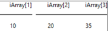
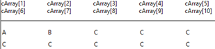
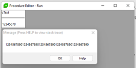
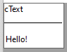
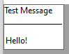
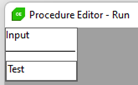
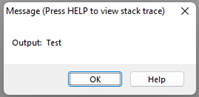

# Basic Progress Lang

## Chapter 01 : Variables

### Basic Variables
These variables are declared with `NO-UNDO`.
That states that no undo handling is wanted for this specific variable in case of a transactional roll-back.

This should always be the default unless transactional control over this variable is a requirement.

```csharp
/* A character is 32K character long */
define variable cChar as character format 'x(40)':U no-undo.

/* Default decimal has 10 digits */
define variable dPrice as decimal decimals 2 no-undo. 

/* EX.format 999 | format 'zz9’| format '-zz9' or 'zz9-' */
define variable iValue as integer format '999' no-undo.

/* LOGICAL = Boolean data. True or false (or ?) */                               
define variable lSwitch as logical format 'on/off':T7 init no no-undo.

/* If unset variables have the unknown value ? */                                  
define variable tDate1 as date init today no-undo. /* 20/12/23 */
define variable tDate2 as datetime no-undo.        /* 20/12/2023 00:00:00,000 */
define variable tDate3 as datetime-TZ no-undo.     /* 20/12/2023 00:00:00,000+07:00 */
 
/* Variable have data type and format like the field or Variable */                                     
define variable cAdressNr like S_Adresse.AdressNr no-undo.

define variable cChar1 as character format 'x(20)':U no-undo.
define variable cChar2 like cChar1 no-undo.
```
### Arrays

Individual positions the array is accessed using `"[]"` brackets.  
And the **index start** at `1` not `0`.   
The maximum size is 28000

```csharp
define variable iArray   as integer   extent 3 init [10,20,35]          no-undo.
define variable cArray   as character extent 3 init ['A':U,'B':U,'C':U] no-undo.
define variable dArray   as decimal   extent 3 init [10.1,20.2,35.3]    no-undo. 
```

**Example**
```csharp
/* Define Array with the length 3 and assign values */
define variable iArray as integer extent 3 init [10,20,35] no-undo.
```
or

```csharp
define variable iArray as integer extent 3 no-undo.
assign
  iArray[1] = 10
  iArray[2] = 20
  iArray[3] = 35
  .
```    

```csharp
define variable iArray as integer extent 3 no-undo.

assign
  iArray[1] = 10
  iArray[2] = 20
  iArray[3] = 35
  .

message iArray. /* Error: you can’t use message to message all of array */

display iArray. 
```  
Result  

    
 
```csharp
message iArray[2] | Display iArray[2] /* 20 */
```
    
If you don't set all extents the remaining will get the last set value 
```csharp
define variable cArray   as character extent 10 init ['A':U,'B':U,'C':U] no-undo.
```
Result  



---

  
## Chapter 02 : Input & Output

### Basic Update and Message/Display

#### Output

1. `message` Everything you want to be displayed.  

   ```csharp
   message 'hello':U.
   ```
2. `display` Everything you want to be displayed.

   ```csharp
   display 'hello:':U.
   ```
     
What difference between `Message` and `Display`




#### Input

`update` – you need to define variable to receive the value 

```csharp
define variable cInput as character no-undo.

update cInput.
```


**Extra :** You can use command `label` to set name of columns when use `display`

without label name 
```csharp
define variable cText as character init 'Hello!':U no-undo.

display cText.
```
  
  

with label name
```csharp
define variable cText as character init 'Hello!':U no-undo.

display cText label 'Test Message':U.
```



**Example :**

```csharp
/* Receive text from the keyboard and display it. */
define variable cTaxt as character no-undo.

update cTaxt label 'Input':U.

message 'Output: ':U cTaxt.
```

Input :   


Output :    


---

## Chapter 03 : Basic Commands

### BEGINS and MATCHES

#### **BEGINS**

`begins` - return **true** if one string begins with another string. 

```csharp
<String1> begins <String2> 
```
If string1 `begins` with (or is equal to) string2 this will return true.   
Otherwise it will return false. If string two is empty `("")` it will always return **true**. 

**Example :**

```csharp
define variable cString1 as character no-undo.
define variable cString2 as character no-undo.

cString1 = 'Hello':U.
cString2 = 'Hello':U.
message cString1 begins cString2. /* YES */

cString1 = 'Hello':U.
cString2 = 'H':U.
message cString1 begins cString2. /* YES */

cString1 = 'Hello':U.
cString2 = '':U.
message cString1 begins cString2. /* YES */

cString1 = 'Hello':U.
cString2 = 'Hello World!':U.
message cString1 begins cString2. /* NO */

```

---

#### **MATCHES**

`matches` return **true** if certain wildcard critera is met in a string.

```
<String1> matches <expression> 
```
Returns **true** if string1 `matches` the wildcard expression : 
  - `*` (asterisk) = 0 to n characters (basically any string of any length)

  - `.` (period) = wildcard for any character (except null) 

**Example**  

```csharp
 define variable cString1 as character no-undo.
 define variable cString2 as character no-undo.

 cString1 = 'Hello':U.
 cString2 = 'Hello':U.
 message cString1 matches cString2. /* YES */

 cString1 = 'Hello':U.
 cString2 = 'H*':U.
 message cString1 matches cString2. /* YES */

 cString1 = 'Hello':U.
 cString2 = '*O':U.
 message cString1 matches cString2. /* YES */

 cString1 = 'Hello World!':U.
 cString2 = 'Hello.World!':U.
 message cString1 matches cString2. /* YES */

 cString1 = 'Hello World!':U.
 cString2 = '*Wor...!':U.
 message cString1 matches cString2. /* NO */

 cString1 = 'Hello World!':U.
 cString2 = 'Wo*ld!':U.
 message cString1 matches cString2. /* NO */

```

### LENGTH

`length` return the number of character.

```csharp
length('abc':U)   /* 3 */
```

### INDEX

`index` return the position of a string in a string.  

```csharp
index(<source>, <target>) 

index(<source>, <target>, <starting-position>)
```

`r-index` will to the same thing but search right to left.

```csharp
r-index(<source>, <target>) 

r-index(<source>, <target>, <starting-position>)
```

> Search target within source (left to right) and return it's position. If it's missing return `0`.
 
> Position start at `1` not `0`.


**Example :**
```csharp
 define variable cTaxt as character init 'ABCDEFGHIJ':U no-undo.

 message   index(cTaxt, 'b':U).          /* 2 */
 message r-index(cTaxt, 'b':U).          /* 2 */
 message   index(cTaxt, 'E':U, 2).       /* 5 */
 message   index(cTaxt, 'E':U, 8).       /* 0 */
 message r-index(cTaxt, 'E':U, 8).       /* 5 */

```

### SUBSTRING

`substring` returns or assigns a part of a string.

```csharp
/* Returns "length" characters from "string" starting on position "starting-position" */
substring(<string>, <starting-position>, <length>) 

/* Returns the rest of "string", starting at position "starting-position" */
substring(<string>, <starting-position>) 
```

**Example :**

```csharp
define variable cTaxt as character init 'ABCDEFGHIJ':U no-undo.

message substring(cTaxt, 3).            /* CDEFGHIJ */
message substring(cTaxt, 3, 2).         /* CD */
```

### CAPS and LC

`caps` make string upper case.

```csharp
caps('Abc':U).                          /* ABC */
```


`lc` make string lower case.

```csharp
lc('Abc':U).                            /* abc */
```

### FILL

`fill` Generates a character string made up of a character string that is repeated a specified number of times. 

```csharp
fill(<expression>, <repeats>).
```

**Example**

```csharp
message fill('Hello':U, 3).  /* HelloHelloHello */
```

### TRIM 

`trim` removes leading and trailing whitespaces (or other characters).

```csharp
/* Removes all leading and trailing spaces, tabs, line feeds, carriage returns */
trim(<string>).

/* Removes all leading and trailing "characters" */
trim(<string>, <character>).
```

`left-trim` and `right-trim` does the same thing but only leading or trailing.

**Example :**
```csharp
message trim(' [a] ':U).             /*[a]*/
message trim(' [a] ':U, 'a':U).       /* [a] */ <-- no change
message trim('abcda':U, 'a':U).       /*bcd*/
message left-trim('abcda':U, 'a':U).  /*bcda*/
message right-trim('abcda':U, 'a':U). /*abcd*/
```

### REPLACE

`replace` replaces a string within a string.

```
replcae(<string>, <from-string>, <to-string>). 
```
**Example :**

```csharp
message replace('eat':U, 'e':U, 'T':U).       /* Tat */
```

### DATE Commands

```csharp
message today.               /* 20/12/23 */
message year(today).         /* 2023 */
message month(today).        /* 12 */
message weekday(today).      /* 4 */ <-- Sunday is 1 to Saturday is 7
message day(today).          /* 20 */
```
### LIST Commands

**"List"** There are a number of functions and methods for working with comma (or other character) separated lists in Progress 4GL. 

Example of **"List"** :

```csharp
define variable cList as character no-undo.

/* Using comma, the default delimiter */
cList = 'One,Two,Five':U.
```

`num-entry` returns the number of entries in a list. You can optionally specify delimiter,comma is default.

**Example :**

```csharp
define variable cList as character no-undo.

/* Using comma, the default delimiter */
cList = 'One,Two,Five':U.
message num-entries(cList).       /* 3 */

/* Using another delimiter, semilcolon */
cList = 'One;Two;Five':U.
message num-entries(cList,';':U). /* 3 */
```


 